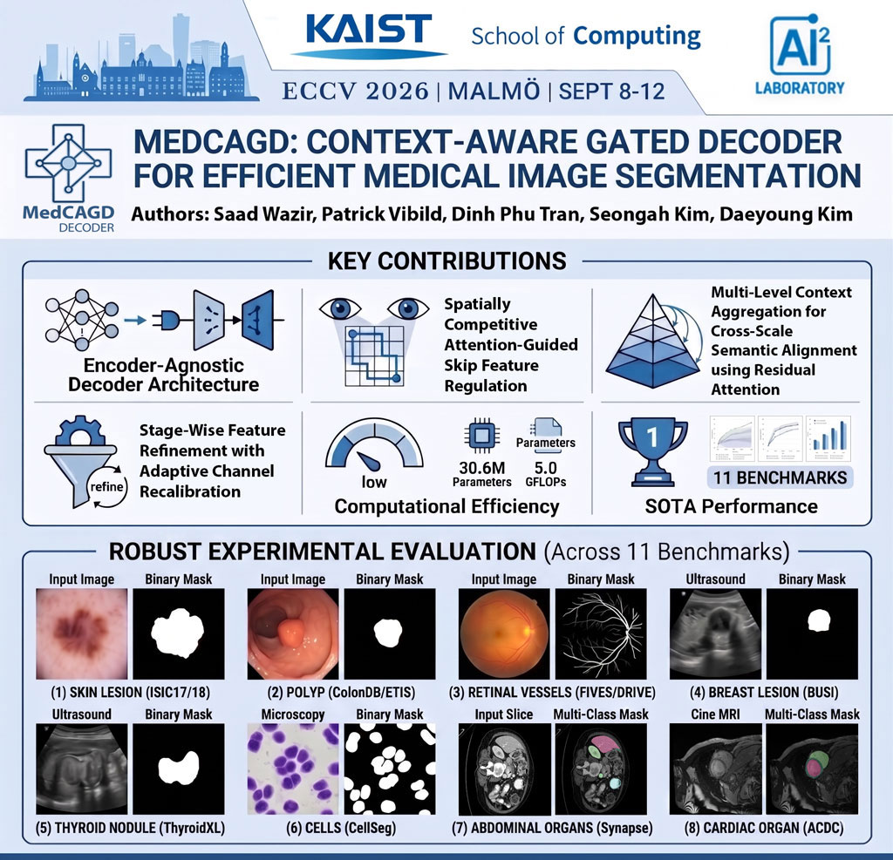

# MedCAGD: Context-Aware Gated Decoder for Efficient Medical Image Segmentation - Accepted in ECCV 2026

Download Paper:
[https://arxiv.org/abs/2607.00409](https://arxiv.org/abs/2607.00409)

Please Cite it as following

```
@inproceedings{wazir2026medcagdcontextawaregateddecoder,
      title={MedCAGD: Context-Aware Gated Decoder for Efficient Medical Image Segmentation}, 
      author={Saad Wazir, Patrick Dominique Vibild, Dinh Phu Tran, Seongah Kim, Daeyoung Kim},
      year={2026},
      eprint={2607.00409},
      archivePrefix={arXiv},
      primaryClass={cs.CV},
      url={https://arxiv.org/abs/2607.00409}, 
}
```



## Download Dataset from Huggingface.
Link: [https://huggingface.co/datasets/saadwazir/MedCAGD-Dataset-Collection](https://huggingface.co/datasets/saadwazir/MedCAGD-Dataset-Collection)


# Medical Image Segmentation

PyTorch image segmentation code (configured for DRIVE retinal vessel patches). The model uses a pretrained `timm` encoder (`pvt_v2_b2` by default), a custom decoder, three auxiliary segmentation outputs, and three edge outputs. It supports binary and multiclass segmentation.

## Environment and dependencies

Run all commands from the repository root, where `cfgs.py` is located. The examples use Linux/bash. Create and activate an environment first:

```bash
python -m venv .venv
source .venv/bin/activate
python -m pip install --upgrade pip
```

Install the packages for training and the `xrun.py` experiment workflow:

```bash
# Training framework and vision support
python -m pip install torch torchvision

# Encoder, losses, augmentation, image processing, arrays, CSV handling, and progress bars
python -m pip install timm segmentation-models-pytorch albumentations opencv-python numpy pandas tqdm

# GPU metrics: this example targets a CUDA 12.x environment
python -m pip install cupy-cuda12x
```

Use a CUDA-enabled PyTorch installation compatible with your NVIDIA driver, and choose the CuPy distribution matching your CUDA environment. Evaluation requires CUDA: `eval_metrics.py` uses CuPy, and evaluation scripts use CUDA timing events even though they contain a CPU device fallback.

Install these additional packages for the optional utilities:

```bash
# CPU metrics for precomputed masks (test_eval_manual.py)
python -m pip install scipy

# Parameter, operation, and FLOP profiling (profile_model.py)
python -m pip install thop fvcore

# Image I/O, patch extraction, and reconstruction (patch.py, unpatch.py)
python -m pip install Pillow patchify
```

Model construction uses `pretrained=True`, so the first run needs access to download encoder weights unless they are already cached.

Check GPU access before starting the experiment:

```bash
python -c "import torch, cupy; print('PyTorch CUDA:', torch.cuda.is_available()); print('CuPy GPUs:', cupy.cuda.runtime.getDeviceCount())"
```

## Quick start: run an experiment with `xrun.py`

1. Prepare paired images and masks under `train/images`, `train/masks`, `val/images`, `val/masks`, `test/images`, and `test/masks` inside your dataset root. See [dataset preparation](#prepare-the-dataset) for details.
2. Edit [cfgs.py](cfgs.py) for a new experiment:

   ```python
   main_dataset_dir = "/absolute/path/to/dataset/"  # Keep the trailing slash
   gpu_list = "0"

   fresh_training = 1  # Change from the current default of 0
   resume_train = 0
   resumed_chkpt = ""

   batch_size = 24
   num_epochs = 8
   tries = 16
   val_eval_threshold = 4
   random_train = 1
   random_seed = 1
   seed_val = 55
   ```

   The current split settings already use `train/`, `val/`, and `test/`. Reduce `batch_size` if GPU memory is insufficient.
3. Start the experiment:

   ```bash
   python xrun.py
   ```

**A fresh experiment deletes the existing `output/` directory.** Preserve any results you need before running with `fresh_training = 1`.

The runner performs up to 16 iterations of 8 training epochs each, stops after 4 consecutive validation checks without improvement, and tests the best validation checkpoint. Results are written to `output/summary.csv`, with detailed metrics under `output/val_eval_results/` and `output/test_eval_results/`.

## How `xrun.py` works

`xrun.py` is the experiment entry point. It launches each stage sequentially with the active Python environment, waits for it to finish, and stops with an error if a stage fails. The runner finishes after final testing and summary writing.

Select GPUs with `gpu_list` in `cfgs.py`, for example `"0"` or `"0,1"`. The current `xrun.py` still accepts `-g`/`--gpu`, but the parsed value is unused; it does not select a GPU or launch a follow-up job. Use `python xrun.py` with GPU selection configured in `cfgs.py`.

Each iteration runs these stages:

1. `train.py` trains for `num_epochs` additional epochs and saves a checkpoint after each epoch.
2. `val_eval.py` evaluates checkpoints on the validation split.
3. `check_val.py` selects the global best checkpoint by validation Dice. The runner preserves newly selected best weights with a `_best_iteration_<n>_lock.pth` filename and updates best-checkpoint CSVs.
4. `stopearly.py` checks whether the best score has improved. `val_eval_threshold` controls patience in iterations, not epochs.
5. The runner prunes checkpoints not retained in best-checkpoint history. If training continues, the next iteration resumes from the global best checkpoint.

After the loop, `test_eval.py` evaluates the best checkpoint on the test split and the runner writes the experiment summary. Because each iteration resumes from the best checkpoint, its starting epoch may precede the end of the previous iteration.

With `random_train = 1`, iteration 1 uses the baseline configuration, then subsequent iterations cycle through rows in `train_random_comb.csv`. Despite its name, configuration selection is sequential, not random. The CSV controls `albumb_aug`, `complex_aug`, `image_only_aug`, `cutmix_augmnet`, `include_original_train`, and `use_amp`. Set `random_train = 0` to keep these settings fixed.

With `random_seed = 1`, iteration seeds are `seed_val + iteration`: the current base seed of `55` gives `56` for the first iteration. Set `random_seed = 0` to keep the base seed across iterations.

The runner saves the initial augmentation/AMP settings in `output/baseline_cfg.csv` and rewrites `cfgs.py` as it operates, including setting `fresh_training = 1` at completion. Check its settings before launching another experiment.

### Resume an experiment

Keep the existing experiment outputs and set:

```python
fresh_training = 0
resume_train = 1
resumed_chkpt = "output/checkpoints/your-checkpoint.pth"
```

Then run `python xrun.py` again. The first iteration resumes from the specified checkpoint; subsequent iterations use the global best validation checkpoint. Configuration cycling is skipped in this resume mode. `tries` limits iterations in this new invocation.

The current defaults `fresh_training = 0` and `resume_train = 0` are rejected by `xrun.py`. Choose either the fresh-experiment settings above or a valid resume configuration before launching it.

## Prepare the dataset

Provide paired image and mask files in this layout:

```text
dataset/
├── train/
│   ├── images/
│   └── masks/
├── val/                 # Separate validation split
│   ├── images/
│   └── masks/
└── test/
    ├── images/
    └── masks/
```

Edit these values in [cfgs.py](cfgs.py):

```python
main_dataset_dir = "/absolute/path/to/dataset/"
train_images_dir = "train/images/*"
train_masks_dir = "train/masks/*"
val_images_dir = "val/images/*"
val_masks_dir = "val/masks/*"
test_images_dir = "test/images/*"
test_masks_dir = "test/masks/*"
```

- Keep the trailing `/` on `main_dataset_dir`: the code concatenates it directly with each split pattern.
- Images and masks are independently sorted and paired by index. Their counts and sorted ordering must match; use corresponding filenames and keep non-image files out of the matching paths.
- Images are read with OpenCV in BGR order, scaled to `[0, 1]`, and resized to `(H, W)`. Masks use nearest-neighbor resizing.
- Binary masks use `0` for background and any positive value for foreground. Multiclass masks must contain integer class IDs from `0` through `num_Classes - 1`.
- With complex augmentation enabled, source images must be large enough for the `(H, W)` random crop, which runs before resizing. Square patches match the default augmentation setup.


## Run training and evaluation

### Basic workflow

Set the dataset paths and GPU in `cfgs.py`. For a new standalone training run:

```python
gpu_list = "0"
resume_train = 0
resumed_chkpt = ""
batch_size = 24
num_epochs = 8
```

Run training, then test evaluation:

```bash
python train.py
python test_eval.py
```

Training uses AdamW with weight decay `1e-4`, saves a timestamped `.pth` checkpoint after every epoch, and appends training losses to CSV. `train.py` does not automatically evaluate validation data. Test evaluation scans `checkpoint_dir` and skips checkpoints already listed in its `eval_status.csv`.

For validation and best-checkpoint selection:

```bash
python val_eval.py
python check_val.py
```

Evaluate one specific checkpoint:

```bash
EVAL_ONLY_CKPT="output/checkpoints/your-checkpoint.pth" python test_eval.py
```

The evaluation-status check still applies when selecting one checkpoint. To evaluate again without reusing old status and metrics, set `eval_root_test` to a new directory in `cfgs.py`.

### Save prediction images

The standard `test_eval.py` reports metrics but does not save prediction PNGs. Use:

```bash
EVAL_ONLY_CKPT="output/checkpoints/your-checkpoint.pth" python test_eval_full.py
```

This script exports segmentation masks, edge maps when enabled, and per-image metric CSVs. It resets the prediction folders and evaluation-status file at the start of each run. Use a separate `eval_root_test` if you need to preserve earlier exports.

### Resume training

```python
fresh_training = 0
resume_train = 1
resumed_chkpt = "output/checkpoints/your-checkpoint.pth"
num_epochs = 8
```

```bash
python train.py
```

`num_epochs` is the number of **additional** epochs. For example, resuming an epoch-8 checkpoint with `num_epochs = 8` trains epochs 9–16. Model and optimizer state are restored; scheduler and AMP scaler state are not stored in checkpoints. Keep the model configuration compatible with the saved weights.

`RESUME_CKPT_OVERRIDE` takes precedence over the resume settings and can be used directly:

```bash
RESUME_CKPT_OVERRIDE="output/checkpoints/your-checkpoint.pth" python train.py
```


### Create patches with `patch.py`

[patch.py](patch.py) extracts paired PNG patches from one dataset split at a time. Its `INPUT_MAIN_DIR` must contain `images/` and `masks/`, with an identically named mask (including extension) for each image. Edit the configuration at the top of the script before running:

```python
INPUT_MAIN_DIR = "/absolute/path/to/full-dataset/train"
OUTPUT_MAIN_DIR = "/absolute/path/to/patch-dataset/train"
PATCH_SIZE = 256
STRIDE = 64
RESIZE = 1
RESIZE_H = 1024
RESIZE_W = 1024
```

```bash
python patch.py
```

Repeat with the corresponding input/output paths for `val` and `test`, then set `main_dataset_dir` in `cfgs.py` to the patch dataset root. The script's current paths target the DRIVE test split; it does not process all splits automatically.

With these settings, each image and mask produces 169 patches named `<original-stem>-patch-0001.png` through `<original-stem>-patch-0169.png`, ordered row by row. Outputs go into `images/` and `masks/`, with `patch_details.csv`, `summary.csv`, and `total.csv` at the output split root. Images use bilinear resizing and masks use nearest-neighbor resizing. Set `RESIZE = 0` to retain the original dimensions; each dimension must be at least `PATCH_SIZE`, and `(dimension - PATCH_SIZE)` must be divisible by `STRIDE`.

**`patch.py` clears the entire configured `OUTPUT_MAIN_DIR` before processing.** Use a separate output directory from the source dataset.

### Reconstruct full images with `unpatch.py`

[unpatch.py](unpatch.py) reconstructs one directory of image or mask patches per run. Set `INPUT_MAIN_DIR` to the directory containing the patch files directly, such as `test/images`, `test/masks`, or one checkpoint's prediction folder exported by `test_eval_full.py`. Set `OUTPUT_MAIN_DIR` to a separate reconstruction directory, then run:

```bash
python unpatch.py
```

Match `PATCH_SIZE` and `STRIDE` to extraction, and set `PATCHED_H` and `PATCHED_W` to the canvas dimensions used when creating the patches. Both scripts currently use 256-pixel patches, stride 64, and a 1024 × 1024 canvas. The dataset path in `cfgs.py` currently names a stride-128 dataset, so update the dataset path or script settings to match your actual data.

Reconstruction requires every patch index from 1 through the expected grid size for each original filename prefix. It saves `<original-stem>.png` plus `patch_details.csv`, `summary.csv`, and `total.csv`. By default, `RESIZE = 1` resizes the reconstructed canvas to `RESIZE_H = 584` and `RESIZE_W = 565`; change these for your dataset or set `RESIZE = 0` to keep the canvas dimensions. Single-channel patches are treated as masks and use nearest-neighbor resizing; color images use bilinear resizing.

**`unpatch.py` clears the configured `OUTPUT_MAIN_DIR` before reconstruction.**


## Configuration reference: `cfgs.py`

Defaults below describe the checked-in source. Edit the file before launching a process; most scripts import its values at startup.

### Device, seeds, and run control

| Setting | Default | Meaning |
| --- | --- | --- |
| `gpu_list` | `"0"` | Visible GPU IDs, e.g. `"0,1"`. Training uses `torch.nn.DataParallel` when multiple GPUs are visible. |
| `random_train` | `1` | Enables configuration cycling in `xrun.py`; has no effect on standalone training. |
| `random_seed` | `1` | In `xrun.py`, uses `seed_val + iteration` when enabled; `0` keeps the base seed. |
| `seed_val` | `55` | Base Python, NumPy, and PyTorch seed. `XRUN_SEED` overrides the main seed; data-loader workers still use `seed_val + worker_id`. |
| `fresh_training` | `0` | In `train.py`, enables dataset samples/statistics when `1`; it does not clear outputs. In `xrun.py`, `1` starts a fresh experiment and deletes `output/`. |
| `resume_train` | `0` | Enables loading `resumed_chkpt` in standalone training. |
| `resumed_chkpt` | `""` | Checkpoint path for resuming model and optimizer state. |
| `tries` | `16` | Maximum `xrun.py` iterations, subject to early stopping. |
| `val_eval_threshold` | `4` | Number of consecutive checks without a strictly better validation Dice score before early stopping. This is not a prediction threshold. |

### Training and model

| Setting | Default | Meaning |
| --- | --- | --- |
| `batch_size` | `24` | Training and standard evaluation batch size. Reduce if GPU memory is insufficient. |
| `num_epochs` | `8` | Epochs per training invocation, including each `xrun.py` iteration. |
| `use_amp` | `False` | Enables CUDA automatic mixed precision and gradient scaling during training. |
| `num_Classes` | `2` | Values up to `2` use one binary output channel; values above `2` use one output channel per class. |
| `loss_name` | `"BCEWithLogitsLoss"` | Automatically set to `"MulticlassBCEWithLogitsLoss"` when `num_Classes > 2`. Other selectors are defined in `loss.py`. |
| `edge_loss_name` | `"EdgeBCELoss"` | Edge loss: `EdgeBCELoss`, `EdgeDiceLoss`, or `EdgeBCEDiceLoss`. |
| `H`, `W` | `256`, `256` | Input height and width used by the dataset and model setup. |
| `size` | `(H, W)` | Derived resize/crop dimensions. |
| `encoder_name_str` | `"pvt_v2_b2"` | Pretrained `timm` feature encoder. Alternative encoders must work with the model's four-feature decoder interface; arbitrary names are not guaranteed to work. |

### Choose or create loss functions

You can choose different segmentation and edge loss functions by setting their exact, case-sensitive name strings in [cfgs.py](cfgs.py): use `loss_name` for segmentation and `edge_loss_name` for edge supervision. Check `get_loss_fn()` and `get_edge_loss_fn()` in [loss.py](loss.py) for the available choices and their implementations.

| Setting / task | Available name strings |
| --- | --- |
| `loss_name` — binary segmentation | `BCEWithLogitsLoss`, `DiceLoss`, `DiceBCELoss`, `LovaszWrapper`, `MCCWrapper`, `dece_bce`, `mL1ACE_bce`, `BinaryFocalLoss`, `BinaryFocalTverskyLoss`, `BinaryAsymmetricFocalLoss` |
| `loss_name` — multiclass segmentation | `MulticlassBCEWithLogitsLoss`, `MulticlassBCEDiceLoss`, `MulticlassFocalLoss`, `MulticlassFocalTverskyLoss`, `MulticlassAsymmetricFocalLoss` |
| `edge_loss_name` | `EdgeBCELoss`, `EdgeDiceLoss`, `EdgeBCEDiceLoss` |

For example, for binary segmentation:

```python
loss_name = "DiceBCELoss"
edge_loss_name = "EdgeBCEDiceLoss"
```

In `cfgs.py`, edit `loss_name` inside the appropriate `num_Classes` branch, or place your assignment after that conditional so the default does not overwrite it. Choose a segmentation loss compatible with your binary or multiclass task. Edge loss contributes to training when `edge_supervision = True`.

You can also create your own loss in `loss.py`. Implement a PyTorch `nn.Module` whose `forward` accepts the model predictions and targets and returns a scalar loss, then add its name and constructor to `get_loss_fn()` or `get_edge_loss_fn()`. Set the matching name string in `cfgs.py`; defining a class alone does not register it with the selectors. Follow the existing implementations for the expected prediction and target shapes.

### Augmentation

| Setting | Default | Meaning |
| --- | --- | --- |
| `train_augmentation_online` | `True` | Master switch for training-time Albumentations and CutMix. |
| `albumb_aug` | `True` | Enables joint geometric transforms; also gates image-only transforms. |
| `complex_aug` | `True` | Adds transpose, random 90° rotation, and random crop to rotation and horizontal/vertical flips. |
| `image_only_aug` | `True` | Adds brightness/contrast, gamma, multiplicative noise, and Gaussian blur to images only. |
| `cutmix_augmnet` | `True` | Applies paired image/mask CutMix with probability `0.6` on eligible samples, independently of `albumb_aug`. Keep this exact spelling. |
| `include_original_train` | `True` | Doubles dataset length: first half is original samples, second half is eligible for augmentation. If augmentation is disabled, both halves contain originals. |

### Deep and edge supervision

| Setting | Default | Meaning |
| --- | --- | --- |
| `deep_supervision` | `True` | Includes the three auxiliary segmentation losses during training. |
| `deep_supervision_weights` | `[1.0, 0.4, 0.3, 0.2]` | Weights for the main prediction followed by the three auxiliary predictions. Must contain four values. |
| `normalize_deep_weights` | `True` | Divides segmentation weights by their sum during training. |
| `edge_supervision` | `True` | Adds edge loss to segmentation loss during training. |
| `edge_weights` | `[1.0, 1.0, 1.0]` | Weights for the three edge predictions. Must contain three values. |
| `normalize_edge_weights` | `True` | Divides edge weights by their sum during training. |

Weight sums must be nonzero when normalization is enabled. Total training loss is segmentation loss plus edge loss when enabled. Evaluation uses the main segmentation output; its edge-loss reporting uses raw `edge_weights`, so it is not directly comparable to normalized training edge loss.

### Dataset paths

| Setting | Default | Meaning |
| --- | --- | --- |
| `main_dataset_dir` | `"../0-datasets/eye-datasets/DRIVE-2004-patches-256-128/"` | Dataset root, relative to the working directory or absolute. |
| `train_images_dir` | `"train/images/*"` | Training image pattern relative to the root. |
| `train_masks_dir` | `"train/masks/*"` | Training mask pattern. |
| `val_images_dir` | `"val/images/*"` | Validation image pattern. |
| `val_masks_dir` | `"val/masks/*"` | Validation mask pattern. |
| `test_images_dir` | `"test/images/*"` | Test image pattern. |
| `test_masks_dir` | `"test/masks/*"` | Test mask pattern. |

### Learning rate

| Setting | Default | Meaning |
| --- | --- | --- |
| `lr` | `1e-4` | Initial AdamW learning rate. |
| `use_lr_schedule` | `1` | Enables `CosineAnnealingWarmRestarts`, stepped after each epoch. |
| `eta_min` | `1e-6` | Minimum scheduled learning rate. |
| `cosine_T0` | `5` | Initial restart period, calculated by `get_cosine_T0(num_epochs)`. |
| `cosine_T_mult` | `1` | Multiplier applied to the restart period after each restart. |

The actual `get_cosine_T0()` implementation returns `2` for `num_epochs <= 1`, `3` for `2–5`, and `5` for anything above `5`. Its existing docstring describes different values; the implementation determines behavior.

### Output paths

| Setting | Default | Contents |
| --- | --- | --- |
| `checkpoint_dir` | `"output/checkpoints/"` | Model/optimizer checkpoints. |
| `sanity_check_logs` | `"output/sanity-check/logs/"` | Dataset and model statistics when `fresh_training = 1`. |
| `train_samples` | `"output/sanity-check/training-samples"` | Sample images and masks when `fresh_training = 1`. |
| `train_logs` | `"output/train-logs/"` | Training log directory. |
| `train_log_loss_file` | `"output/train-logs/train-loss.csv"` | Checkpoint name, epoch, loss, and elapsed time. |
| `eval_root_val` | `"output/val_eval_results"` | Validation metrics, best-checkpoint CSVs, and early-stop state. |
| `eval_root_test` | `"output/test_eval_results"` | Test metrics and optional prediction exports. |

Evaluation summaries are written under `<eval_root>/pred-csv/summary_metrics.csv` with Dice, precision, recall, HD95, and IoU. Binary prediction threshold is fixed at `0.5` in evaluation calls. Stage logs are written to `output/run_log.csv`; `xrun.py` also writes `output/summary.csv`. Some utilities hard-code `output/`, so changing configurable paths does not relocate every artifact.

## Standalone Python scripts

Run these scripts from the repository root with the environment activated. Configure dataset paths and training settings in `cfgs.py`; script-specific settings and required inputs are noted below.

| Script | Command | Purpose and required inputs |
| --- | --- | --- |
| `xrun.py` | `python xrun.py` | Runs the complete experiment: training, validation, best-checkpoint selection, early stopping, and final testing. Requires a fresh or resume configuration as described above. |
| `train.py` | `python train.py` | Trains or resumes the segmentation model using `cfgs.py`, saving a checkpoint after each epoch and appending loss logs. Requires paired training images and masks. |
| `test_eval.py` | `python test_eval.py` | Evaluates checkpoints on the test split and writes summary metrics. Requires test images/masks, checkpoints, and CUDA. Supports `EVAL_ONLY_CKPT` to select one checkpoint. |
| `test_eval_full.py` | `python test_eval_full.py` | Evaluates test data and exports prediction masks, optional edge maps, and per-image metrics. Supports `EVAL_ONLY_CKPT`; resets prediction folders and evaluation status on each run. Requires CUDA. |
| `test_eval_manual.py` | `python test_eval_manual.py` | Computes metrics from existing prediction masks and matching ground-truth masks without model inference. Edit its own input paths, output CSV paths, and `NUM_CLASSES`; ensure output parent directories exist. |
| `profile_model.py` | `python profile_model.py` | Measures parameters, MACs, FLOPs, inference latency, and throughput using synthetic inputs; saves results to `flops.txt`. Requires CUDA and profiling dependencies. Edit its own precision, batch-size, GPU, and benchmark overrides if needed. |
| `patch.py` | `python patch.py` | Extracts paired image/mask patches from one split and writes patch CSVs. Edit its input/output roots, patch size, stride, and optional resize settings; see [patch creation](#create-patches-with-patchpy). Clears the configured output directory before extraction. |
| `unpatch.py` | `python unpatch.py` | Reconstructs full images/masks from named patches and writes reconstruction CSVs. Edit its input/output paths, patch size, stride, grid dimensions, and resize settings. Point the input at a directory containing patch files directly, such as one checkpoint's prediction folder. Clears the configured output directory before reconstruction. |

### Practical note

For tiny datasets with `fresh_training = 1`, keep `batch_size` no larger than the effective training dataset length: sample export uses `random.sample(..., batch_size)`.


## Benchmark Results

<table>
<caption>Table: 1 - Comprehensive performance comparison across 9 medical image segmentation benchmarks. Average Dice scores are reported.</caption>
<thead>
<tr>
<th rowspan="2">Method</th>
<th rowspan="2">Params ↓</th>
<th rowspan="2">FLOPs ↓</th>
<th colspan="2">Skin</th>
<th colspan="2">Polyp</th>
<th colspan="2">Fundus</th>
<th colspan="2">Neoplasm</th>
<th>Cell</th>
<th>All</th>
</tr>
<tr>
<th>ISIC17</th><th>ISIC18</th>
<th>ETIS</th><th>ColonDB</th>
<th>DRIVE</th><th>FIVES</th>
<th>BUSI</th><th>ThyroidXL</th>
<th>CellSeg</th><th>Avg</th>
</tr>
</thead>
<tbody>
<tr><td>U-Net</td><td>34.53 M</td><td>65.53 G</td><td>83.07</td><td>86.67</td><td>76.85</td><td>83.95</td><td>71.20</td><td>75.77</td><td>74.04</td><td>71.16</td><td>71.52</td><td>77.14</td></tr>
<tr><td>AttnUNet</td><td>34.88 M</td><td>66.64 G</td><td>83.66</td><td>87.05</td><td>76.84</td><td>86.46</td><td>71.68</td><td>75.99</td><td>74.48</td><td>72.50</td><td>72.64</td><td>77.92</td></tr>
<tr><td>DeepLabv3+</td><td>39.76 M</td><td>14.92 G</td><td>83.84</td><td>88.64</td><td>90.73</td><td>91.92</td><td>69.59</td><td>75.12</td><td>76.81</td><td>73.46</td><td>71.90</td><td>80.22</td></tr>
<tr><td>UNet++</td><td><u>09.16 M</u></td><td>34.65 G</td><td>82.98</td><td>87.46</td><td>77.40</td><td>87.88</td><td>72.94</td><td><u>85.74</u></td><td>74.46</td><td>83.94</td><td>78.30</td><td>81.23</td></tr>
<tr><td>nnU-Net</td><td>31.29 M</td><td>55.26 G</td><td>83.23</td><td>88.53</td><td>80.13</td><td>91.63</td><td>75.43</td><td>76.10</td><td>76.46</td><td>86.08</td><td>83.53</td><td>82.34</td></tr>
<tr><td>PraNet</td><td>32.55 M</td><td>06.93 G</td><td>83.03</td><td>88.56</td><td>83.84</td><td>89.16</td><td>75.21</td><td>84.57</td><td>75.14</td><td>85.51</td><td>79.07</td><td>82.68</td></tr>
<tr><td>TransUNet</td><td>105.32 M</td><td>38.52 G</td><td>85.00</td><td>89.16</td><td>87.79</td><td>91.63</td><td>74.98</td><td>83.54</td><td>78.30</td><td>85.77</td><td>79.08</td><td>83.92</td></tr>
<tr><td>Swin-Unet</td><td>27.17 M</td><td>06.20 G</td><td>83.97</td><td>89.26</td><td>85.10</td><td>89.27</td><td>74.93</td><td>84.17</td><td>77.38</td><td>85.80</td><td>78.84</td><td>83.19</td></tr>
<tr><td>UCTransNet</td><td>65.60 M</td><td>56.70 G</td><td>83.27</td><td>89.18</td><td>87.35</td><td>91.65</td><td>75.42</td><td>84.74</td><td>79.53</td><td>85.82</td><td>79.33</td><td>84.03</td></tr>
<tr><td>UNeXt</td><td><strong>1.470 M</strong></td><td><strong>0.570 G</strong></td><td>82.74</td><td>87.78</td><td>74.03</td><td>83.84</td><td>74.77</td><td>76.60</td><td>74.71</td><td>84.46</td><td>75.71</td><td>79.40</td></tr>
<tr><td>VM-UNet</td><td>27.43 M</td><td><u>04.12 G</u></td><td><u>85.99</u></td><td>87.05</td><td>85.52</td><td>88.71</td><td>73.25</td><td>83.51</td><td>74.69</td><td>78.31</td><td>74.94</td><td>81.33</td></tr>
<tr><td>Swin-UMamba</td><td>60.00 M</td><td>68.00 G</td><td>83.40</td><td>87.62</td><td>86.63</td><td>87.97</td><td>73.32</td><td>82.66</td><td>73.38</td><td>84.96</td><td>75.56</td><td>81.72</td></tr>
<tr><td>EMCAD</td><td>26.76 M</td><td>05.60 G</td><td>85.95</td><td>90.96</td><td><u>92.29</u></td><td><u>92.31</u></td><td>77.15</td><td>82.51</td><td><u>80.25</u></td><td>83.33</td><td>79.13</td><td>84.87</td></tr>
<tr><td>MCADS</td><td>50.90 M</td><td>61.89 G</td><td>84.14</td><td><u>91.01</u></td><td>92.24</td><td>91.37</td><td><u>78.42</u></td><td>76.05</td><td>80.03</td><td><u>86.33</u></td><td><strong>86.68</strong></td><td><u>85.14</u></td></tr>
<tr><td><strong>Ours</strong></td><td>30.60 M</td><td>05.00 G</td><td><strong>86.61</strong></td><td><strong>91.56</strong></td><td><strong>93.47</strong></td><td><strong>93.27</strong></td><td><strong>81.63</strong></td><td><strong>87.50</strong></td><td><strong>83.47</strong></td><td><strong>88.02</strong></td><td><u>86.61</u></td><td><strong>88.01</strong></td></tr>
<tr><td>AutoSam*</td><td>41.56 M</td><td>25.11 G</td><td>-</td><td>-</td><td>79.70</td><td>83.00</td><td>-</td><td>-</td><td>-</td><td>-</td><td>-</td><td>-</td></tr>
<tr><td>Medical SAM3*</td><td>840.0 M</td><td>-</td><td>-</td><td>-</td><td>86.10</td><td>-</td><td>55.80</td><td>-</td><td>-</td><td>-</td><td>-</td><td>-</td></tr>
</tbody></table>


<table>
<caption>Table: 2 - Performance comparison with SOTA methods on the Synapse multi-organ dataset.</caption>
<thead><tr><th>Method</th><th>Dice ↑</th><th>IoU ↑</th><th>HD95 ↓</th><th>Aorta</th><th>GB</th><th>KL</th><th>KR</th><th>Liver</th><th>PC</th><th>SP</th><th>SM</th></tr></thead><tbody><tr><td>U-Net</td><td>70.11</td><td>59.39</td><td>44.69</td><td>84.00</td><td>56.70</td><td>72.41</td><td>62.64</td><td>86.98</td><td>48.73</td><td>81.48</td><td>67.96</td></tr><tr><td>AttnUNet</td><td>71.70</td><td>68.09</td><td>26.01</td><td>84.04</td><td>66.42</td><td>57.26</td><td>84.53</td><td>81.28</td><td>73.87</td><td>66.06</td><td>60.17</td></tr><tr><td>UNet++</td><td>72.39</td><td>68.82</td><td>25.61</td><td>83.65</td><td>67.66</td><td>57.26</td><td>84.53</td><td>81.34</td><td>73.87</td><td>68.97</td><td>61.85</td></tr><tr><td>nnU-Net</td><td>75.33</td><td>71.47</td><td>19.34</td><td>77.06</td><td>73.27</td><td>76.34</td><td>84.53</td><td>79.98</td><td>73.34</td><td>77.62</td><td>60.52</td></tr><tr><td>PraNetV2</td><td>83.75</td><td>74.81</td><td>17.77</td><td>88.69</td><td>72.79</td><td>85.41</td><td>82.91</td><td><u>95.82</u></td><td>68.47</td><td><u>93.09</u></td><td><u>85.85</u></td></tr><tr><td>TransUNet</td><td>77.61</td><td>67.32</td><td>26.90</td><td>86.56</td><td>60.43</td><td>80.54</td><td>78.53</td><td>94.33</td><td>58.47</td><td>87.06</td><td>75.00</td></tr><tr><td>Swin-Unet</td><td>77.58</td><td>66.88</td><td>27.32</td><td>81.76</td><td>65.95</td><td>82.32</td><td>79.22</td><td>93.73</td><td>53.81</td><td>88.04</td><td>75.79</td></tr><tr><td>UCTransNet</td><td>79.08</td><td>75.41</td><td>15.59</td><td>83.06</td><td>81.35</td><td>77.24</td><td>78.23</td><td>85.76</td><td>74.77</td><td>81.89</td><td>70.31</td></tr><tr><td>UNETR*</td><td>78.35</td><td>-</td><td>18.59</td><td>89.80</td><td>56.30</td><td>85.60</td><td>84.52</td><td>94.57</td><td>60.47</td><td>85.00</td><td>70.46</td></tr><tr><td>MISSFormer*</td><td>81.96</td><td>-</td><td>18.20</td><td>86.99</td><td>68.65</td><td>85.21</td><td>82.00</td><td>94.41</td><td>65.67</td><td>91.92</td><td>80.81</td></tr><tr><td>U-Mamba</td><td>78.63</td><td>74.87</td><td>16.19</td><td>83.77</td><td>78.70</td><td>79.40</td><td>82.37</td><td>83.86</td><td>74.78</td><td>79.77</td><td>66.41</td></tr><tr><td>VM-UNet</td><td>73.39</td><td>71.61</td><td>27.97</td><td>63.57</td><td>72.62</td><td>77.98</td><td><strong>92.59</strong></td><td>79.44</td><td>70.80</td><td>55.58</td><td>74.55</td></tr><tr><td>EMCAD</td><td>83.63</td><td>74.65</td><td>15.68</td><td>88.14</td><td>68.87</td><td><u>88.08</u></td><td>84.10</td><td>95.26</td><td>68.51</td><td>92.17</td><td>83.92</td></tr><tr><td>MCADS</td><td>85.03</td><td><u>81.71</u></td><td><strong>11.11</strong></td><td>90.81</td><td><u>86.07</u></td><td>86.77</td><td>83.24</td><td>87.66</td><td><strong>83.55</strong></td><td>85.74</td><td>76.38</td></tr><tr><td><strong>Ours</strong></td><td><strong>87.00±0.2</strong></td><td><strong>83.77</strong></td><td><u>14.39</u></td><td><strong>92.28</strong></td><td><strong>90.31</strong></td><td><strong>89.72</strong></td><td><u>87.21</u></td><td>91.02</td><td><u>82.08</u></td><td>86.91</td><td>76.51</td></tr><tr><td>Self-Prompt SAM*</td><td><u>86.74</u></td><td>-</td><td>-</td><td><u>91.99</u></td><td>69.95</td><td>85.65</td><td>85.40</td><td><strong>97.39</strong></td><td>79.18</td><td><strong>94.38</strong></td><td><strong>89.94</strong></td></tr></tbody></table>

<table>
<caption>Table: 3 - Performance comparison with SOTA methods on the ACDC dataset.</caption>
<thead><tr><th>Method</th><th>Dice ↑</th><th>IoU ↑</th><th>HD95 ↓</th><th>RV</th><th>Myo</th><th>LV</th></tr></thead><tbody><tr><td>U-Net</td><td>81.56</td><td>73.41</td><td>6.9854</td><td>76.99</td><td>80.28</td><td>87.43</td></tr><tr><td>AttnUNet</td><td>82.37</td><td>73.94</td><td>6.1684</td><td>78.13</td><td>81.08</td><td>87.89</td></tr><tr><td>UNet++</td><td>81.97</td><td>73.92</td><td>6.4724</td><td>77.74</td><td>80.73</td><td>87.44</td></tr><tr><td>nnU-Net</td><td>82.66</td><td>74.27</td><td>6.1663</td><td>79.00</td><td>81.01</td><td>87.97</td></tr><tr><td>PraNetV2</td><td>83.74</td><td>76.13</td><td>6.3719</td><td>79.61</td><td>83.10</td><td>88.51</td></tr><tr><td>TransUNet</td><td>83.07</td><td>74.85</td><td>5.7578</td><td>79.16</td><td>81.65</td><td>88.41</td></tr><tr><td>Swin-Unet</td><td>82.61</td><td>74.59</td><td>6.1244</td><td>78.94</td><td>80.17</td><td>88.73</td></tr><tr><td>UCTransNet</td><td>84.89</td><td>77.57</td><td>5.6995</td><td>80.94</td><td>84.11</td><td><u>89.62</u></td></tr><tr><td>U-Mamba</td><td>84.18</td><td>76.47</td><td>5.8501</td><td>80.90</td><td>83.24</td><td>88.40</td></tr><tr><td>VM-UNet</td><td>81.02</td><td>72.74</td><td>7.0025</td><td>76.75</td><td>79.40</td><td>86.90</td></tr><tr><td>EMCAD</td><td><u>85.07</u></td><td><u>77.73</u></td><td><u>5.2472</u></td><td><u>81.58</u></td><td><u>84.23</u></td><td>89.42</td></tr><tr><td>MCADS</td><td>84.51</td><td>76.92</td><td>5.5595</td><td>81.16</td><td>83.27</td><td>89.09</td></tr><tr><td><strong>Ours</strong></td><td><strong>87.54±0.3</strong></td><td><strong>80.96</strong></td><td><strong>4.4057</strong></td><td><strong>85.27</strong></td><td><strong>86.23</strong></td><td><strong>91.11</strong></td></tr></tbody></table>
